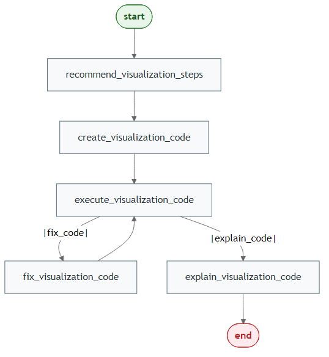

# Visualization Agent

## What This Agent Does

[`build_visualization_agent()`](https://knowusuboaky.github.io/LLMAgentR/reference/build_visualization_agent.md)
generates visualization code and explanations from data and user chart
instructions.

## Workflow Diagram



## Generate Mermaid PNGs

``` r
library(LLMAgentR)

my_llm_wrapper <- function(prompt, verbose = FALSE) "LLM response placeholder"

workflow <- build_visualization_agent(
  model = my_llm_wrapper,
  output = "both",
  direction = "LR"
)

save_mermaid_png(
  x = workflow,
  file = "pkgdown/assets/visualization-agent-workflow.png"
)
```

## Step 1: Build the Agent

``` r
library(LLMAgentR)

my_llm_wrapper <- function(prompt, verbose = FALSE) "LLM response placeholder"

viz_agent <- build_visualization_agent(
  model = my_llm_wrapper,
  human_validation = FALSE,
  bypass_recommended_steps = FALSE,
  bypass_explain_code = FALSE,
  function_name = "data_visualization",
  verbose = FALSE
)
```

## Step 2: Run with State

``` r
initial_state <- list(
  data_raw = mtcars,
  target_variable = "mpg",
  user_instructions = "Create a clean scatter plot of wt vs mpg with color by cyl.",
  max_retries = 3,
  retry_count = 0
)

final_state <- viz_agent(initial_state)
str(final_state)
```

## Notes for Beginners

- Use explicit chart instructions (x, y, grouping, title).
- Ask for readable themes and clear labels.
- Keep generated chart code for reproducibility.
