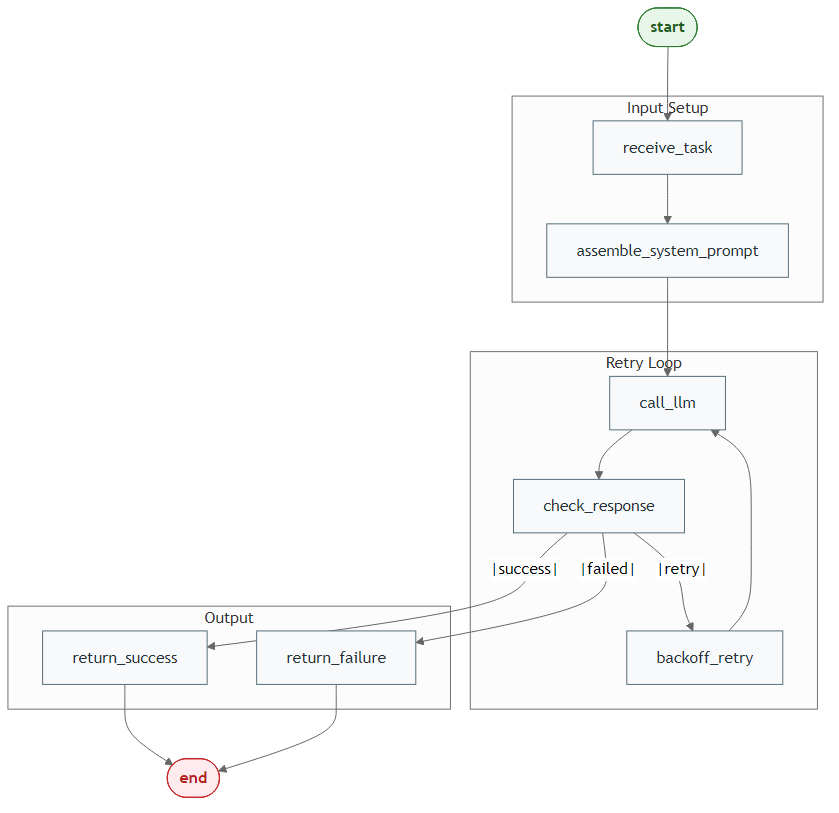
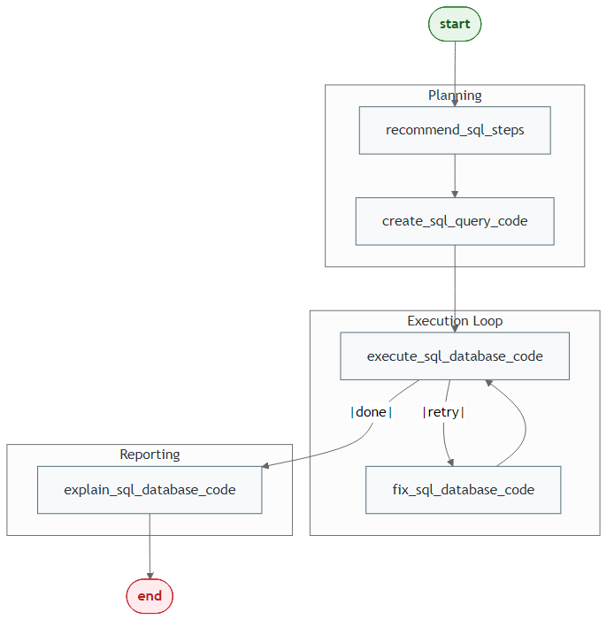
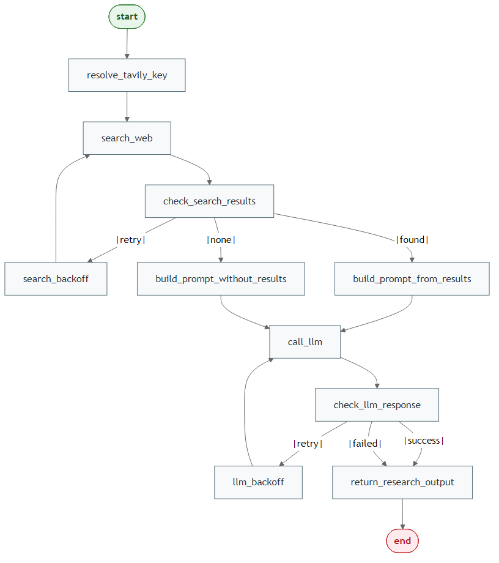
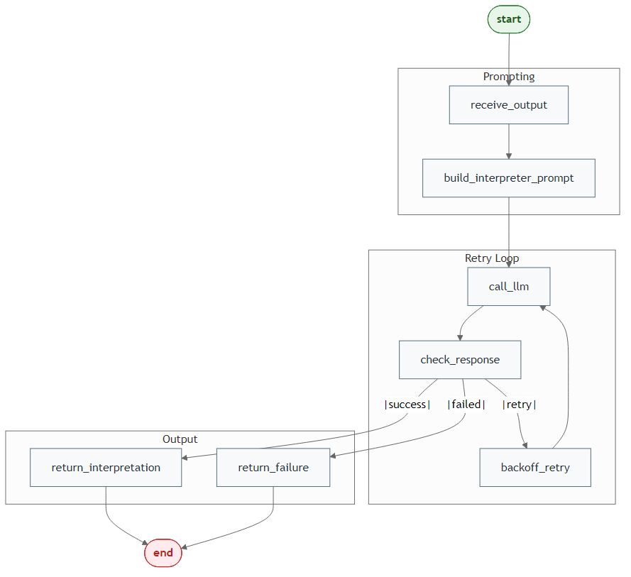
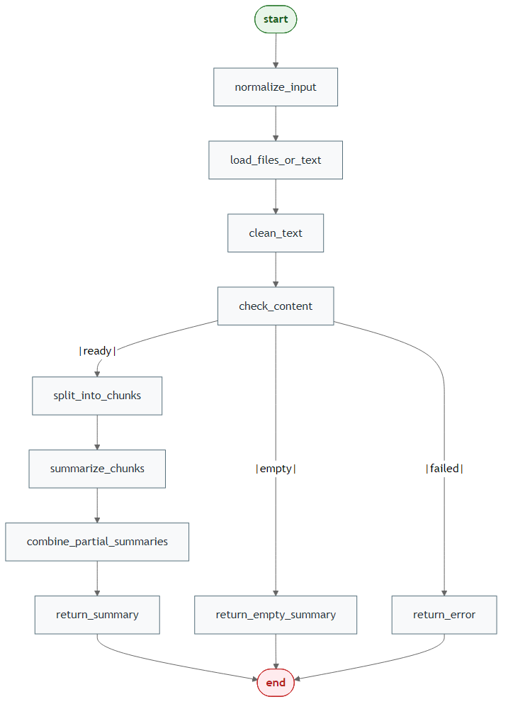
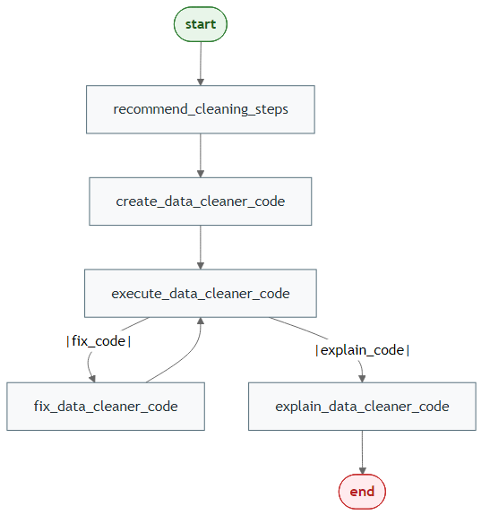
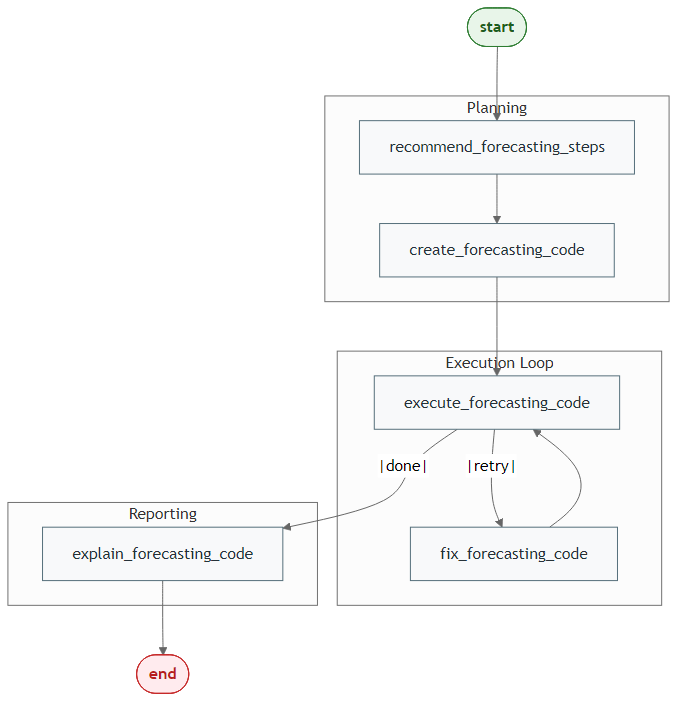
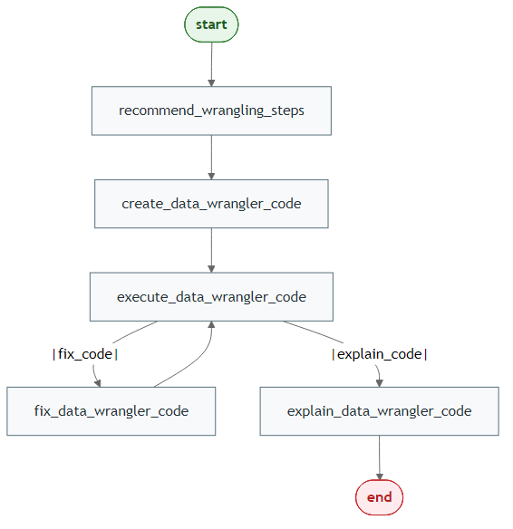
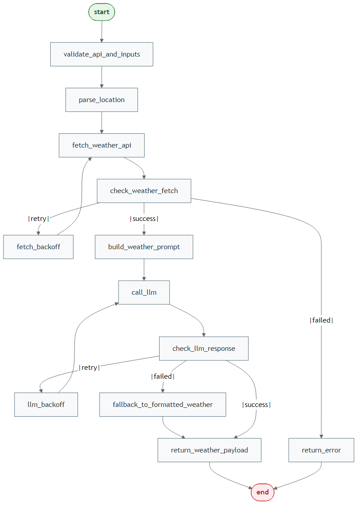
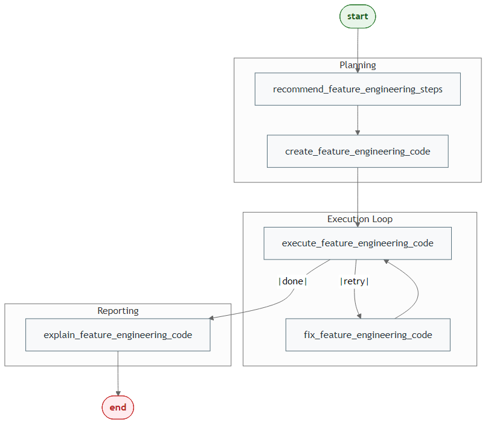

## Overview

This index links to one article per agent and also shows the workflow diagram
for each agent.

## Generate Mermaid PNGs

Use the built-in generator script (`compile_graph()` + `save_mermaid_png()`):

```{r, eval = FALSE}
# From the LLMAgentR project root
source("pkgdown/generate-agent-workflow-pngs.R")

# Generate all workflow PNGs
generate_all_agent_workflow_pngs()

# Or generate only one workflow PNG
generate_agent_workflow_png("code-agent")
```

## Core Agents

### Code Generation Agent

Article: [Code Generation Agent](code-agent.html)



```{r, eval = FALSE}
source("pkgdown/generate-agent-workflow-pngs.R")
generate_agent_workflow_png("code-agent")
```

### SQL Query Agent

Article: [SQL Query Agent](sql-agent.html)



```{r, eval = FALSE}
source("pkgdown/generate-agent-workflow-pngs.R")
generate_agent_workflow_png("sql-agent")
```

### Research Agent

Article: [Research Agent](research-agent.html)



```{r, eval = FALSE}
source("pkgdown/generate-agent-workflow-pngs.R")
generate_agent_workflow_png("research-agent")
```

### Interpreter Agent

Article: [Interpreter Agent](interpreter-agent.html)



```{r, eval = FALSE}
source("pkgdown/generate-agent-workflow-pngs.R")
generate_agent_workflow_png("interpreter-agent")
```

### Document Summarizer Agent

Article: [Document Summarizer Agent](document-summarizer-agent.html)



```{r, eval = FALSE}
source("pkgdown/generate-agent-workflow-pngs.R")
generate_agent_workflow_png("document-summarizer-agent")
```

### Data Cleaning Agent

Article: [Data Cleaning Agent](data-cleaning-agent.html)



```{r, eval = FALSE}
source("pkgdown/generate-agent-workflow-pngs.R")
generate_agent_workflow_png("data-cleaning-agent")
```

### Forecasting Agent

Article: [Forecasting Agent](forecasting-agent.html)



```{r, eval = FALSE}
source("pkgdown/generate-agent-workflow-pngs.R")
generate_agent_workflow_png("forecasting-agent")
```

### Data Wrangling Agent

Article: [Data Wrangling Agent](data-wrangling-agent.html)



```{r, eval = FALSE}
source("pkgdown/generate-agent-workflow-pngs.R")
generate_agent_workflow_png("data-wrangling-agent")
```

### Weather Agent

Article: [Weather Agent](weather-agent.html)



```{r, eval = FALSE}
source("pkgdown/generate-agent-workflow-pngs.R")
generate_agent_workflow_png("weather-agent")
```

### Feature Engineering Agent

Article: [Feature Engineering Agent](feature-engineering-agent.html)



```{r, eval = FALSE}
source("pkgdown/generate-agent-workflow-pngs.R")
generate_agent_workflow_png("feature-engineering-agent")
```

### Visualization Agent

Article: [Visualization Agent](visualization-agent.html)


```{r, eval = FALSE}
source("pkgdown/generate-agent-workflow-pngs.R")
generate_agent_workflow_png("visualization-agent")
```

## Custom Graph Workflows

- [Building Custom Agents](custom-agents.html)
- [Building Multi-Agent Teams](multi-agent-teams.html)

